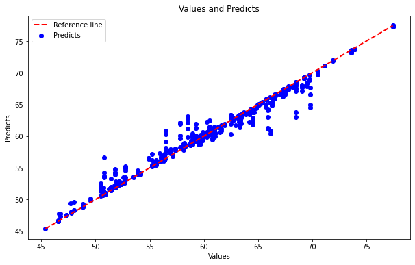

<!-- 

<b>Building smart cities smartly.</b>

  

  

 -->

# UFCity AI models

## [Slow traffic forecast](/slow-traffic-forecast)
**Dataset:** [Urban traffic density in cities](https://www.kaggle.com/datasets/tanishqdublish/urban-traffic-density-in-cities?resource=download)

**Objetivo:** identificar lentidão na cidade com base nas condições, climáticas, hora, dia, horário de pico, acidentes e densidade do tráfego da cidade.

**Método utilizado:** Regressão baseada em árvores de decisão.

**Ferramenta utilizada:** Random Forest Regressor

**Resultado:**  
- Mean Squared Error: 1.289537341629248
- R2 Score: 0.9688701457764887

## [weather-forecast](/weather-forecast)
**Dataset:** [CityPulse](http://iot.ee.surrey.ac.uk:8080/datasets.html#weather)

**Objetivo:** prever tendência de séries com base em dados climáticos, como pressure, humidity, temperature, wind direction, and speed sensors.

**Método utilizado:** Regressão baseada em médias móveis para analisar tendências de séries.

**Ferramenta utilizada:** AutoRegressive Integrated Moving Average (ARIMA)

**Resultado:**  
- hum  ARIMA(5,1,2)(0,0,0)[0]          
- tempm  ARIMA(1,1,3)(0,0,0)[0]          
- wspdm  ARIMA(0,1,2)(0,0,0)[0]          
- wdird  ARIMA(4,1,4)(0,0,0)[0]
- pressurem  ARIMA(4,1,5)(0,0,0)[0]          
- dewptm  ARIMA(2,1,2)(0,0,0)[0]

  
  
  

